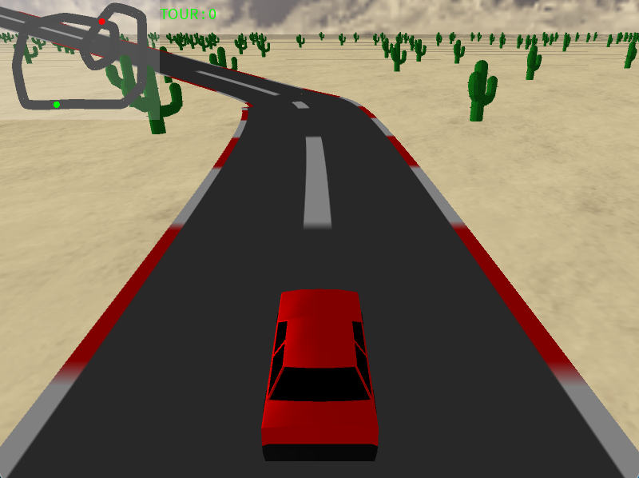
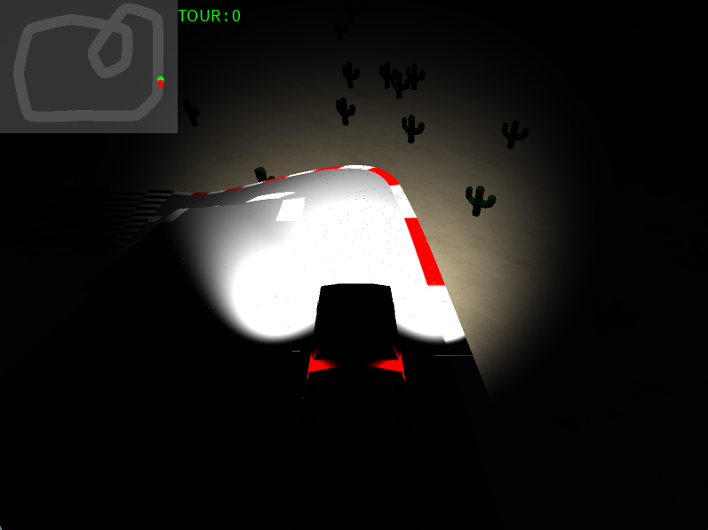

# circuit-3d-glsl

## Description 
Ce projet est une simulation de course en 3D développée en **Java** avec l'environnement **Processing**. 
L'objectif principal était de mettre en œuvre un pipeline de rendu graphique personnalisé via des shaders **GLSL**.

## Points Techniques Clés
* **Pipeline GLSL Complet **: Implémentation d'un mode nuit avec gestion dynamique des phares.
* **Modèle d'Éclairage **: Utilisation d'une atténuation quadratique et d'un falloff smoothstep pour un rendu réaliste des sources lumineuses.
* **Géométrie du Circuit **: Le tracé est généré mathématiquement par des courbes de Bézier.
* **Optimisation 3D **: Gestion des vertex normals et utilisation du face culling pour optimiser les performances du moteur.

## Technologies Utilisées
* Langages : Java, GLSL 
* Outils : Processing

## Images du jeu 

## Exécution du Projet

### Prérequis

* Processing IDE (version 4.x recommandée) OU IntelliJ IDEA avec le plugin Processing.
* Une carte graphique supportant le GLSL 1.2 ou supérieur pour le rendu des shaders.

### Lancement via Processing IDE
1. Téléchargez ou clonez le dépôt.
2. Ouvrez le fichier `Course.pde` dans Processing.
3. Cliquez sur le bouton Run.

### Lancement via IntelliJ IDEA
1. Importez le projet en tant que projet Java.
2. Ajoutez la librairie core.jar de Processing à votre Build Path.
3. Exécutez la classe principale qui contient la méthode main appelant PApplet.main().

### Contrôles
* Z / S : Accélérer / Freiner.
* Q / D : Tourner à gauche / droite.
* N : Activer/Désactiver le mode nuit et le pipeline de shaders
